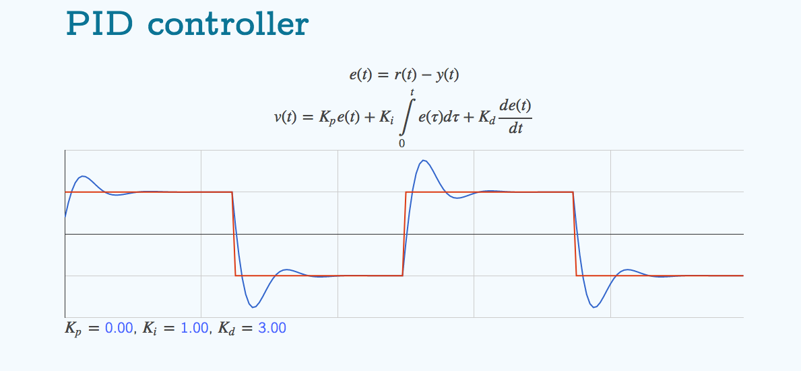
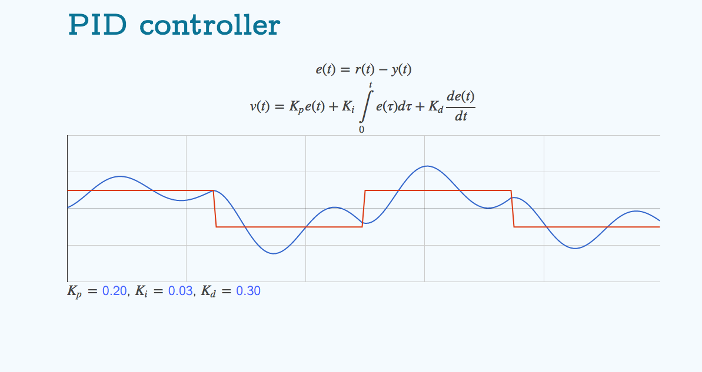
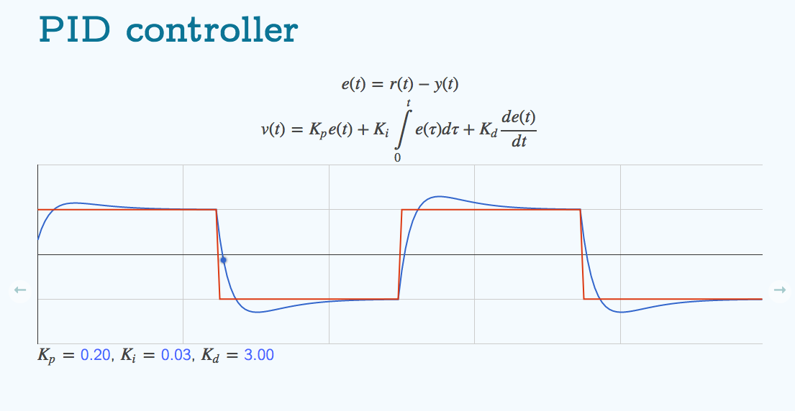

# Reflection

## The process

At first it seemed like I would be able to simply choose the hyperparameters myself.

I found a [visualizer online](http://molefrog.com/pidnn-talk/#pid-demo) that I thought would make it easy to create the reactions I'd want to.

At first I was getting very jittery performance and I didn't know why. My car would rapidly oscillate between steering angles of -1 and 1, it would move forward but it wasn't doing well.

After reading some forum posts and through the slack channel I realized that the differential gain wasn't resisting change the way it should have been. This is because I wasn't considering dt when calculating my integral error or my differential error.

I made the adjustments and when calculating my total error I was now multiplying `cte` and `dt` before adding it to the total, that way our integral was actually considering the width underneath our hypotherical curve.

This got us to our first working implementation! Moving at the brisk speed of `13.45`mph.

The params currently were just sebastian's. (Kp= 0.20, Ki= 0.03, Kd= 0.30)
This was consistent with our visualization, but it had our car moving side to side a good bit.

I wanted to increase the differential gain a little bit in order to make sure that our vehicle wouldn't jitter so quickly and we could move faster.

Increasing the differential gain was the way to go, the visualizer seemed to reflect what I wanted.

For some reason this didn't work! The car would move along the track even slower.(`1.4`mph)

## Proportional Gain
I used Sebastian's Proportional constant.

## Integral constant
I used Sebastian's Integral constant

## Differential constant
I described the process of tuning this above.
